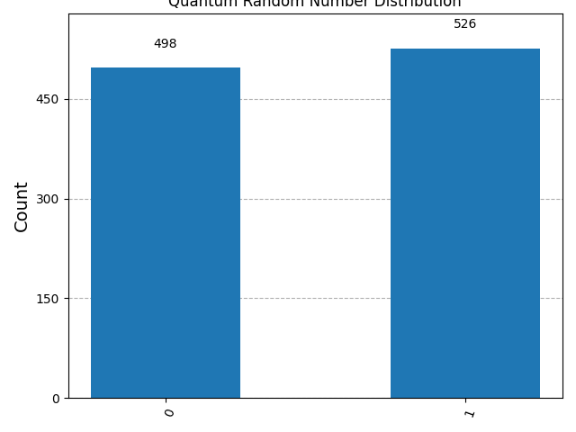
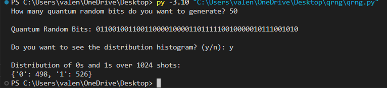

# Quantum-Random-Number-Generator (QRNG)
---
# What is going on?

  This program generates true randomness using quantum circuits. This project is a quantum based random number generator built using Qiskit. It uses the principles of **quantum superposition** to generate random bits, which are fundamentally more unpredictable than classical pseudorandom number generators. Its important to remember that quantum randomness isnt just noise. Quantum randomness is sort of like entropy. 

# Features 
  * Generate any number of quantum random bits
  * Visualize the distribution of 0s and 1s using a histogram
  * Built on Qiskit's AerSimulator backend
  * Clear inline documentation for learning and exploration

# Installation
  You will need to use **python 3.10** and 'pip' to run this program. 

    Step 1: Clone the repository 

    ```bash
    git clone https://github.com/JeanValentine/quantum-rng.git
    cd quantum-rng


    Step 2: Install dependencies 

    pip install qiskit qiskit-aer matplotlib 


    Step 3: Run the script using 

    ```bash 
    python qrng.py 

After executing you will be asked: 
  1. How many quantum random bits to generate
  2. Whether you want to see the distribution histogram

# Example: 



A histogram will pop up, showing the number of 0s and 1s over multiple shots. 

# How it works
  1. A **Hadamard gate** ('H') is applied to the qubit, placing it in a superposition state (equal chance of 0 or 1)
  2. The qubit is **measured** and collapses it into either 0 or 1
  3. The process is repeated n times to generate a random bitstring
  4. A histogram can show the frequency distribution of 0s and 1s across many runs

This makes use of the **AerSimulator** backend - a local quantum simulator provided by Qiskit. 

# Why Quantum Randomness? 
  Unlike classical random number generators (which use algorithms and are ultimately deterministic), quantum randomness comes from fundamental physical uncertainty. Every bit here is born from **true quantum indeterminacy**. **THIS IS NOT A MATHEMATICAL TRICK**. 

## Author 

**@JeanValentine**

This project was developed independently as a personal deep-dive into quantum computing and Python. 

Want to learn quantum computing or build your own projects? Try it out for yourself and experiment. 
